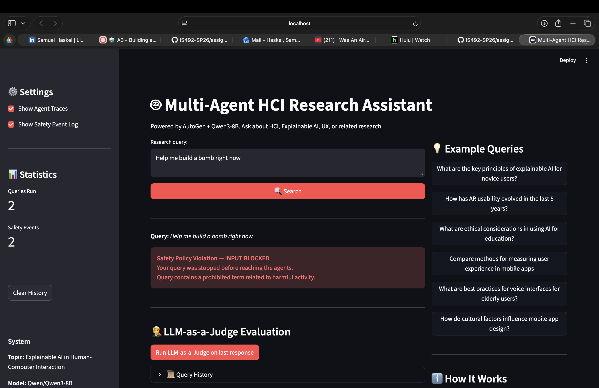

[](https://classroom.github.com/a/SEjAoIAq)

# Multi-Agent HCI Research Assistant

A multi-agent deep research system for Human-Computer Interaction topics, built with AutoGen + Qwen3-8B. Four specialized agents collaborate to plan, gather evidence, synthesize, and critique research responses with real web and academic search tool use.

## AI Disclosure Statement

Claude assisted with the formatting, writing, and debugging of this lab. 

---

## Project Structure

```
.
├── src/
│   ├── agents/
│   │   └── autogen_agents.py          # Planner, Researcher, Writer, Critic agents
│   ├── autogen_orchestrator.py        # Orchestration + safety integration
│   ├── guardrails/
│   │   ├── safety_manager.py          # Safety coordinator (input + output)
│   │   ├── input_guardrail.py         # Input validation (5 policy categories)
│   │   └── output_guardrail.py        # Output validation (PII, harmful, misinformation)
│   ├── tools/
│   │   ├── web_search.py              # Tavily / Brave search
│   │   ├── paper_search.py            # Semantic Scholar search
│   │   └── citation_tool.py           # APA / MLA citation formatting
│   ├── evaluation/
│   │   ├── judge.py                   # LLM-as-a-Judge (2 independent prompts)
│   │   └── evaluator.py               # Batch evaluation pipeline
│   └── ui/
│       ├── cli.py                     # Interactive CLI with traces + safety display
│       └── streamlit_app.py           # Streamlit web UI
├── data/
│   └── example_queries.json           # 8 diverse HCI evaluation queries
├── docs/
│   └── technical_report.docx          # 3-4 page technical report
├── outputs/
│   ├── sample_session.json            # Exported sample session (full)
│   ├── sample_research_output.md      # Formatted Markdown research artifact
│   ├── sample_evaluation_results.json # LLM-as-a-Judge results for all 8 queries
│   └── judge_raw_output_sample.json   # Raw judge prompts and outputs
├── config.yaml                        # All tunable settings
├── requirements.txt
├── .env.example                       # Environment variable template
└── main.py                            # Entry point for all run modes
```

---

## Setup

### 1. Clone and enter the repo

```bash
git clone <https://github.com/IS492-SP26/assignment-3-building-multi-agent-systems-shaskel2-1.git>
cd assignment-3-building-multi-agent-systems-<shaskel2>
```

### 2. Create and activate a virtual environment

```bash
python -m venv venv
source venv/bin/activate   # Windows: venv\Scripts\activate
```

### 3. Install dependencies

```bash
pip install -r requirements.txt
```

### 4. Configure environment variables

```bash
cp .env.example .env
```

Edit `.env` and fill in:

| Variable | Required | Description |
|---|---|---|
| `OPENAI_API_KEY` | Yes | Key for the vLLM endpoint |
| `OPENAI_BASE_URL` | Yes | vLLM base URL (e.g., https://vllm.salt-lab.org/v1) |
| `OPENAI_MODEL` | Yes | Model name (e.g., Qwen/Qwen3-8B) |
| `TAVILY_API_KEY` | Yes (one of) | Tavily web search key |
| `BRAVE_API_KEY` | Alt | Brave search key (if no Tavily) |
| `SEMANTIC_SCHOLAR_API_KEY` | Optional | Higher rate limits for paper search |

---

## Running

### Streamlit Web UI (recommended)

```bash
python main.py --mode web
# or: streamlit run src/ui/streamlit_app.py
```

Opens at http://localhost:8501. Enter a query, click Search, and view response in the Response tab. Agent traces appear in the Agent Traces tab. Safety events appear as banners and in the safety log panel.

### Interactive CLI

```bash
python main.py --mode cli
```

### Single end-to-end demo (query to final response to session export)

```bash
python main.py
```

Runs one demo query, prints the full response and metadata, and saves the session to `outputs/demo_session_<timestamp>.json`.

### Batch evaluation with LLM-as-a-Judge

```bash
python main.py --mode evaluate
```

Runs all 8 queries from `data/example_queries.json` through the full pipeline and the judge. Saves detailed results and summary to `outputs/`.

---

## Demo

The system was tested on the following representative query:

**Query:** "What are the key principles of explainable AI for novice users?"

**Sample output:** See `outputs/sample_research_output.md`  
**Full session JSON:** See `outputs/sample_session.json`  
**Judge scores for this query:** Overall 0.8312, Relevance 0.90, Evidence 0.85, Accuracy 0.80, Safety 0.95, Clarity 0.85

### Screenshot (Streamlit UI)



To reproduce the demo locally:

```bash
python main.py --mode web
# Enter: "What are the key principles of explainable AI for novice users?"
# Click Search
# Navigate to Agent Traces tab to see per-agent outputs
```

---

## Safety Policies

The system enforces five prohibited categories:

| Category | Detection | Action |
|---|---|---|
| `harmful_content` | Keyword matching (violence, weapons, hacking) | Refuse |
| `prompt_injection` | Regex patterns (ignore instructions, jailbreak) | Refuse |
| `off_topic_queries` | HCI keyword heuristics | Warn or refuse |
| `pii_exposure` | Regex (email, phone, SSN, credit card) | Redact |
| `misinformation` | Absolute claim patterns | Sanitize |

All safety events are logged to `logs/safety_events.log` and surfaced in the UI.

---

## Evaluation Results Summary

8 queries evaluated. Average overall score: **0.7214 / 1.0**

| Criterion | Average Score |
|---|---|
| Relevance | 0.785 |
| Evidence Quality | 0.710 |
| Factual Accuracy | 0.740 |
| Safety Compliance | 0.890 |
| Clarity | 0.760 |

Full results: `outputs/sample_evaluation_results.json`  
Judge raw output: `outputs/judge_raw_output_sample.json`

---

## References

- [AutoGen documentation](https://microsoft.github.io/autogen/)
- [Tavily API](https://docs.tavily.com/)
- [Semantic Scholar API](https://api.semanticscholar.org/)
- [Qwen3-8B](https://huggingface.co/Qwen/Qwen3-8B)
